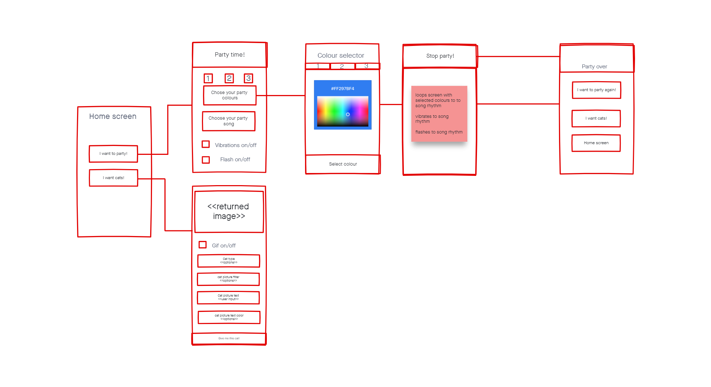
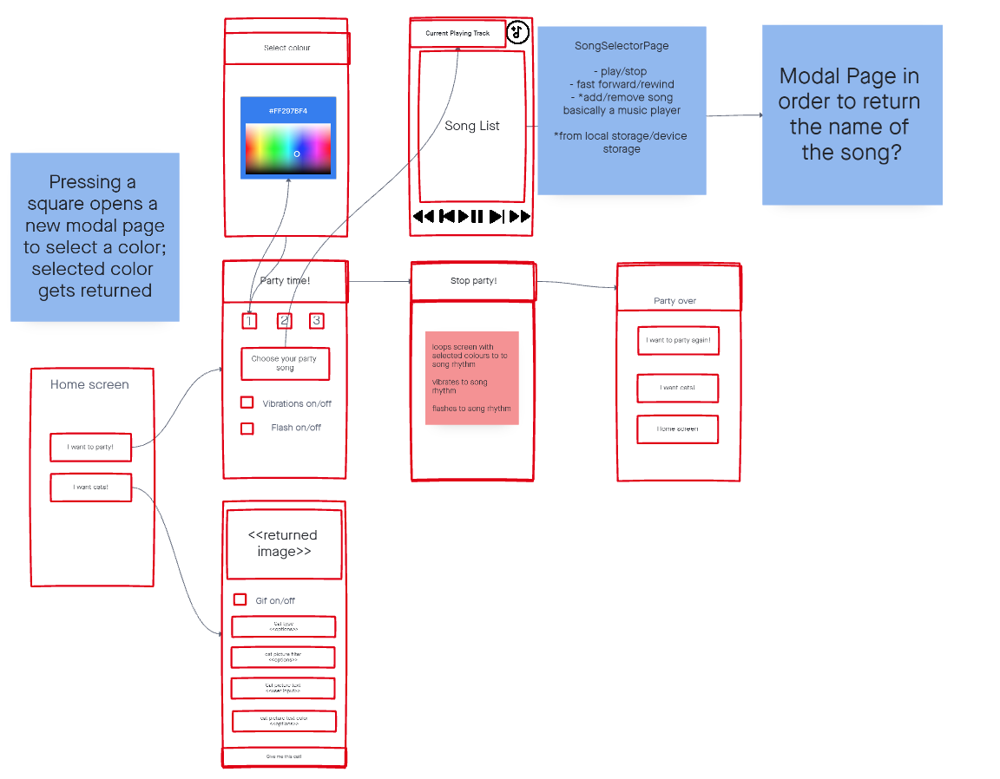

# Mobile Party

## *PE1 Voorstel *
## Project
Een applicatie waarmee de gebruiker zijn eigen kleine draagbare discobal kan hebben. De gebruiker kan tot 3 verschillende kleuren en een liedje kiezen om het feest te beginnen. De vibratie en flitsfuncties kunnen desgewenst ook worden ingeschakeld om dingen op te fleuren.

Het liedje wordt gelezen uit de lokale opslag; een beschikbare playlist moet worden geïmplementeerd, met de mogelijkheid om nummers uit de lokale opslag toe te voegen.

Wanneer geklikt op de Party time! knop, wil ik het scherm door de geselecteerde kleuren laten loopen en het apparaat laten flitsen/trillen als de gebruiker dat wil.

Naast de mobiele party kan een gebruiker om een kattenfoto of gif vragen, door gebruik te maken van de katten-API.(https://cataas.com/#/)

## Extra info

- using Xam.Plugin.SimpleAudioPlayer  or Plugin.MediaManager in order to read audio files from the device
- using Xamarin Flashlight API
- using Xamarin Vibrator API
- using https://www.nuget.org/packages/Udara.Plugin.XFColorPickerControl/ package for a colour picker

## Wireframe

## Bronnen

- https://docs.microsoft.com/en-us/xamarin/essentials/vibrate?tabs=android
- https://docs.microsoft.com/en-us/xamarin/essentials/flashlight?tabs=android
- https://www.nuget.org/packages/Udara.Plugin.XFColorPickerControl/
- https://www.nuget.org/packages/Plugin.MediaManager/
- https://www.nuget.org/packages/Xam.Plugin.SimpleAudioPlayer
- https://cataas.com/#/

## *PE2 Prototype *

TabPages zijn weg, ik heb ervoor gekozen om het zo te maken dat wanneer een gebruiker op een vierkant klikt, een modal page verschijnt. De gekozen kleur komt terug op de PartyConfigurationPage.
Ik vind deze methode gebruiksvriendelijker dan het doorlopen van tabbladen.

Voor de PartySongSelectorPage ging ik echt down the rabbit hole en besloot ik een mini mediaspeler te implementeren. Hiervoor gebruik ik de https://www.nuget.org/packages/Plugin.MediaManager/ plug-in.

Ik ben erg blij met de lay-out van het PartySongSelectorPage, hoewel het erg tijdrovend was om te prutsen met de Grids en Grids in Grids, en om de lay-out er decent uit te laten zien op zowel Android als UWP.

Een van de meest irritante dingen was om de labels op dezelfde lijn te krijgen als de switch elementen.
Ik veranderde een waarde en toen was het op dezelfde regel op Android, maar totaal anders op UWP en omgekeerd.